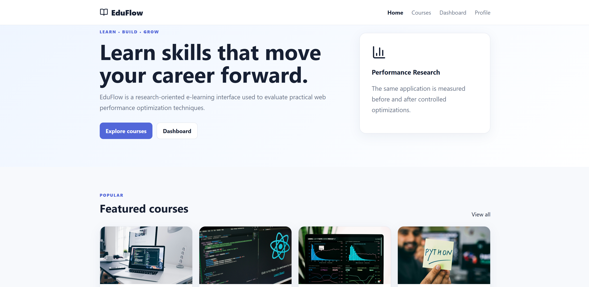
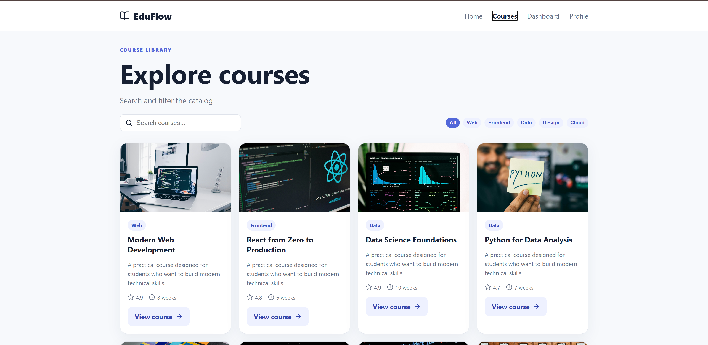
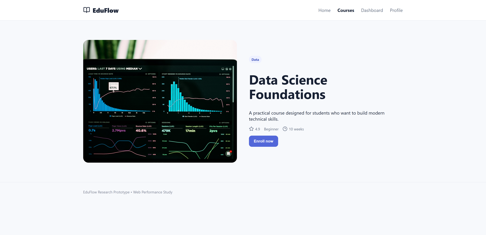
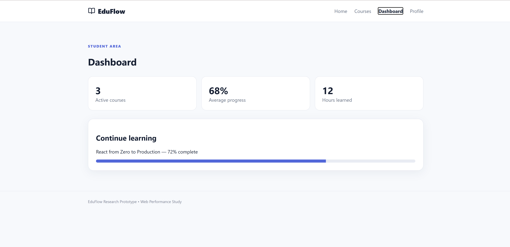

# EduFlow — Web Performance Optimization Research Project

## Research Title

**Evaluating Modern Web Performance Optimization Techniques in a React-Based Educational Web Application: An Experimental Study**

## Overview

EduFlow is an independent research project developed to experimentally evaluate modern web performance optimization techniques in a React-based educational web application.

The study compares six experimental configurations, from an intentionally unoptimized baseline to a combined optimization version.

## Experimental Versions

| Version | Optimization |
|---|---|
| V0 | Baseline |
| V1 | Image Optimization |
| V2 | Lazy Loading |
| V3 | Code Splitting |
| V4 | Delivery Optimization |
| V5 | Combined Optimizations |

Each configuration was evaluated using **five Lighthouse runs**.

## Evaluation Metrics

The experiment measures:

- Performance Score
- First Contentful Paint (FCP)
- Largest Contentful Paint (LCP)
- Total Blocking Time (TBT)
- Cumulative Layout Shift (CLS)
- Speed Index

## Main Finding

Under the tested experimental conditions, **V2 (Lazy Loading)** produced the lowest mean FCP, LCP, TBT, and Speed Index among the six configurations.

Compared with V0:

- FCP improved by approximately **1.0%**
- LCP improved by approximately **0.9%**
- TBT improved by approximately **16.3%**
- Speed Index improved by approximately **1.0%**

These findings are specific to the tested application and experimental environment.

## Application Screenshots

### Home Page

### Courses

### Course Details

### Student Dashboard

## Research Paper

The complete research paper is available here:

**[EduFlow Research Paper](EduFlow_Research.pdf)**

## Experimental Environment

- React
- Vite
- Node.js
- Chrome Headless
- Lighthouse 13.5.0
- Mobile emulation
- 412 × 823 viewport
- CPU slowdown: 4×
- Network throttling applied during Lighthouse testing

## Reproducibility

The repository contains:

- Source code
- Experimental versions
- Lighthouse experiment results
- Scripts used for experiments
- Research documentation
- Research paper
- Application screenshots

## My Contribution

This project was independently developed as a research project for an **Open Doors Scholarship application**.

The work includes:

- Research topic definition
- React application development
- Experimental design
- Performance optimization implementations
- Lighthouse-based measurements
- Results analysis
- Research paper preparation
- Documentation and reproducibility materials

## Academic Context

This is an **Independent Research Project** prepared in support of an Open Doors Scholarship application.

It does not claim to be an awarded Master's thesis, an institutional Master's research project, or a published paper.
